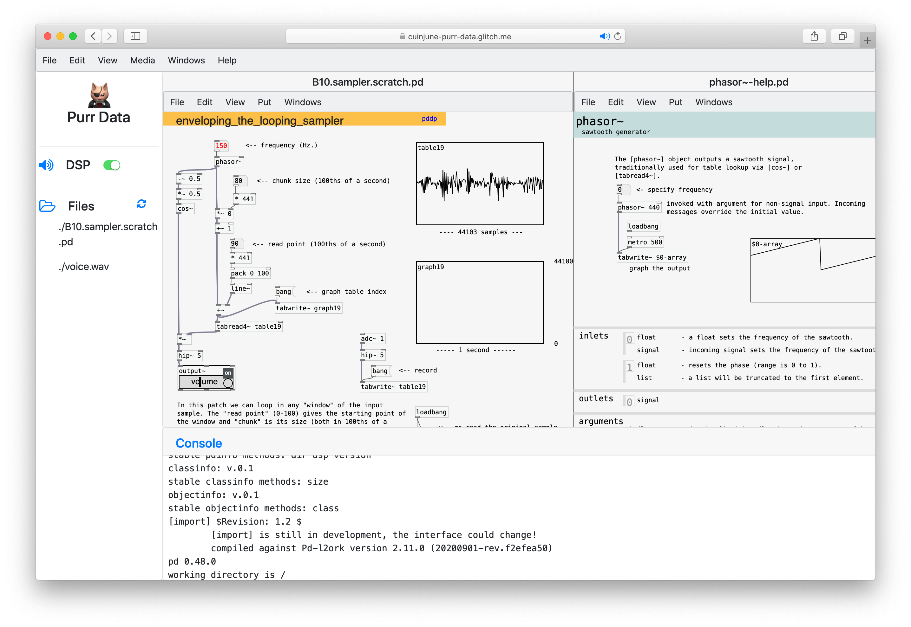

# Purr Data


## Table of Contents
- [Overview](#overview)
- [Developers](#developers)
- [Accomplished Milestones](#accomplished-milestones)
- [Setup](#setup)
- [Directory Structure](#directory-structure)
- [Future Work](#future-work)
- [Reporting Bugs](#reporting-bugs)

## Overview
This document describes the work that was done under [Google Summer of Code 2020](https://summerofcode.withgoogle.com/) a.k.a. GSoC for organization Purr Data. The project idea was to make the native Purr Data run in a web browser by adding a WebAssembly target and HTML5 GUI framework.

**Purr Data** a.k.a. **Pd-l2ork 2** is an improved version of Miller Puckette’s Pd.

[Pd](https://puredata.info/) (Pure Data) is a graphical data-flow programming environment which is geared towards real-time interactive computer music and multimedia applications. It is a full-featured open-source alternative to its commercial sibling, Cycling74’s [Max](https://cycling74.com/products/max-features).

[Purr Data](https://agraef.github.io/purr-data/) serves the same purpose, but offers a new and much improved graphical user interface and includes many 3rd party plug-ins. Like Pd, it runs on Linux, macOS and Windows, and is open-source throughout.

The goal of this project is to make the graphical programming environment Purr Data run in a web browser so it can be more accessible to users.

You can try the latest version from https://purrdata.glitch.me/

## Developers
- The backend part of the software has been mainly done by Zack Lee (cuinjune@gmail.com)
- The frontend part of the software has been mainly done by Hugo Carvalho (hugonvsc@gmail.com)

## Accomplished Milestones
- Modified the native Purr Data and libpd codebase to make them compatible with [Emscripten](https://emscripten.org/). (Zack)
- Modified and created Makefile to build for Emscripten and to generate WebAssembly(`.wasm`) binaries for external libraries. (Zack)
- Cleaned the backend codebase and organized the file system so the project can be easily maintained. (Zack)
- Modified the existing NW.js based source code to make them compatible with web browsers. (Hugo)
- Reimplemented some elements(menu, canvas, style) specifically for the web browser. (Hugo)
- Integrated the backend with the frontend. (Hugo, Zack)
- Fixed some major bugs and errors in the frontend. (Hugo, Zack)

## Setup

### Installing Dependencies (Linux)
```
sudo apt-get install git automake cmake fakeroot dpkg-dev libgconf-2-4
```

### Installing Node.js (macOS, Linux)
```
curl -o- https://raw.githubusercontent.com/nvm-sh/nvm/v0.37.2/install.sh | bash
```

### Installing/Activating Emscripten (macOS, Linux)
```
git clone https://github.com/emscripten-core/emsdk.git
cd emsdk
git pull
./emsdk install latest
./emsdk activate latest
source ./emsdk_env.sh
cd ..
```

### Building Purr Data for Emscripten (macOS, Linux)
```
git clone https://git.purrdata.net/jwilkes/purr-data.git
cd purr-data
git checkout emscripten
make emscripten
```
### Setting up the project (Windows)
```
Method 1

- git clone https://git.purrdata.net/jwilkes/purr-data.git
- cd purr-data
- run command npm install.
- Change directory to purr-data/emscripten/project/purr-data.
- run command npm run build.
- run command npm start.

Method 2

- Follow the steps given in the link inorder to install Ubuntu LTS (https://docs.microsoft.com/en-us/windows/wsl/) .
- Then follow the steps mentioned in above sections for Linux.
```
### Running Purr Data in a web browser
- After the building is successfully completed, visit http://localhost:5000 in your browser.
- You can run `npm start` under `purr-data/emscripten/project/purr-data` to run the app again.

## Directory Structure
- components: Elements that are dynamically added to the page. (canvas, dialogs, menu)
- components/dialogs: Copied dialogs files from `purr-data/pd/nw` folder.
- css: Copied css files from `purr-data/pd/nw/css` folder.
- css/webapp: Styles created for the web browser.
- dist: Browserified Javascript files. (pdgui.js, pd_shortcuts.js, pd_canvas.js)
- libs: External dependencies.
- utils: Common functions used for this project.

## Future Work
- Fix shortcuts so they can work identically in browsers as the native Purr Data.
- Fix getting stuck in the loading screen until a mouse/key event is triggered in Firefox/Safari.
- Fix the patch not responding to mouse event after the help file is opened and not being clicked.
- Fix wrong mouse coordinate issue that happens in some circumstances.
- Fix or disable some of the global menu items not working.
- Fix graphical arrays being opened if the patch font size changes. 
- Ask for saving the patch when the user closes an edited patch.
- Make the GUI(e.g. bang, toggle) property dialog window work.
- Make the dialog windows(e.g. property, text) appear on the right side of the patch instead of the left sidebar.
- Merge the patch menu into the global menu and make it work depending on the focus of patches.
- Style the patch window menu bar so it can show the focus state and add some buttons (e.g. close) for convenience.
- Make the patch window resizable by dragging its border.
- Make the patch window rearrangeable by dragging its menu bar.
- Improve the file manager so the files/folders can be added/renamed/deleted.
- Clean the frontend codebase and organize the file system.
- Make the work storable and shareable between users.

## Reporting Bugs
If you find any bugs, please let us know. You can contact using the [mailing list](http://disis.music.vt.edu/listinfo/l2ork-dev) or create an [issue](https://git.purrdata.net/jwilkes/purr-data/-/issues).
